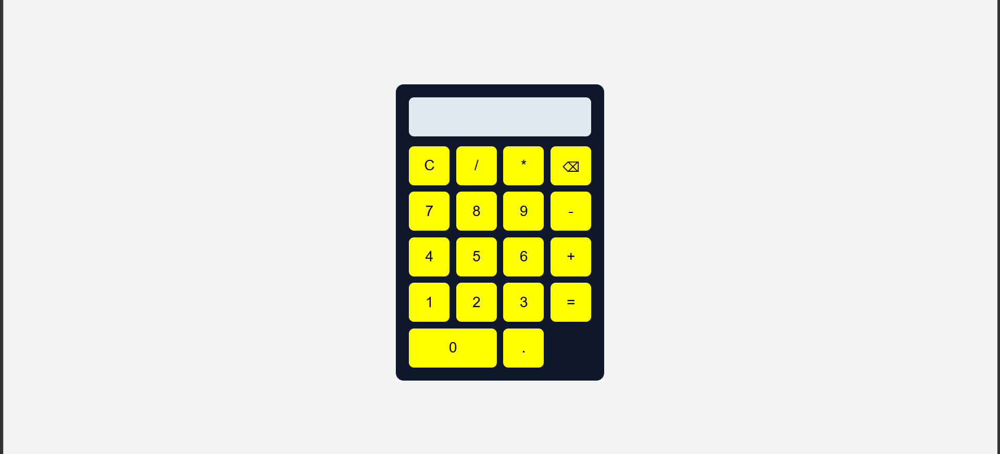

# Calculator App

A simple and responsive calculator built using HTML, CSS, and JavaScript.

##  Features

- Basic arithmetic operations
  - Addition (+)
  - Subtraction (-)
  - Multiplication (×)
  - Division (÷)
- Clear (C) button
- Backspace/Delete button
- Responsive design for desktop and mobile devices
- Error handling for invalid expressions

##  Technologies Used

- HTML
- CSS
- JavaScript 

##  Project Structure

calculator/
│
├── index.html
├── style.css
├── script.js
└── README.md

##  How to Run

1. Clone the repository:

git clone https://github.com/amyelsaaa-dev/calculator.git

2. Open the project folder.

3. Open `index.html` in your browser.

##  Screenshot

##  What I Learned

- HTML structure and forms
- CSS Grid and responsive design
- JavaScript DOM manipulation
- Event handling
- Git and GitHub basics

## 👩‍💻 Author

**Amy**

GitHub: https://github.com/amyelsaaa-dev

---

This project was created as part of my web development learning journey using HTML, CSS, JavaScript, and GitHub.
